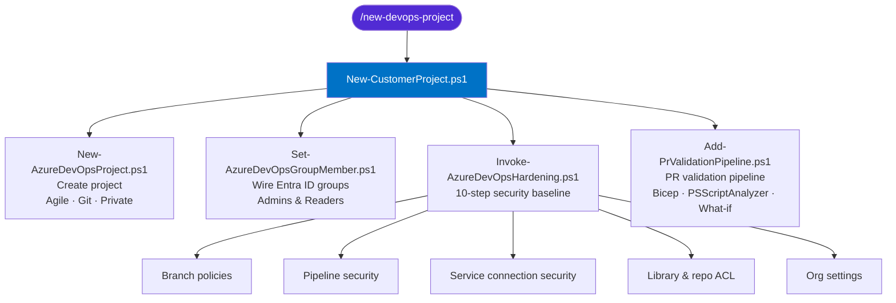

# Azure DevOps Customer Project Automation

> Scripts and Claude Code skills for creating, securing, and maintaining customer Azure DevOps projects.



---

## Contents

| Path | What it does |
|---|---|
| `scripts/project/New-CustomerProject.ps1` | Orchestrates full project setup — create, wire Entra ID groups, harden |
| `scripts/project/New-AzureDevOpsProject.ps1` | Creates an ADO project (Agile, Git, private) |
| `scripts/pipeline/Add-PrValidationPipeline.ps1` | Commits the PR validation YAML, creates the pipeline definition, and applies the build validation branch policy |
| `scripts/pipeline/New-AzureDevOpsPipeline.ps1` | Creates a pipeline definition from a YAML file |
| `scripts/security/Invoke-AzureDevOpsHardening.ps1` | Orchestrates all 10 security hardening steps |
| `scripts/security/Set-AzureDevOpsBranchPolicies.ps1` | Applies branch policies (min reviewers, squash, build validation, etc.) |
| `scripts/security/Set-AzureDevOpsPipelineSecurity.ps1` | Applies project-level pipeline security settings |
| `scripts/security/Set-AzureDevOpsServiceConnectionSecurity.ps1` | Locks service connections to specific pipelines |
| `scripts/security/Set-AzureDevOpsGroupMember.ps1` | Adds/removes users and groups from ADO security groups |
| `scripts/security/Set-AzureDevOpsOrgSettings.ps1` | Applies organisation-level security settings |
| `scripts/security/Get-AzureDevOpsAudit.ps1` | Audits Project Administrator group membership |
| `scripts/security/New-AzureDevOpsPipelineOperatorAccess.ps1` | Creates a pipeline operator group with minimum permissions |
| `scripts/security/_Helpers.ps1` | Shared auth and API helpers (dot-sourced by all security scripts) |
| `scripts/service-connection/New-AzureDevOpsServiceConnection.ps1` | Creates a service connection |
| `pipelines/pr-validation-data-platform.yml` | PR validation pipeline for Data Platform projects |
| `pipelines/pr-validation-fabric-accelerator.yml` | PR validation pipeline for Fabric Accelerator projects |
| `skills/new-devops-project.md` | Claude Code `/new-devops-project` skill |

---

## Quick Start — New Customer Project

**Prerequisites:** `Connect-AzAccount` in your terminal, Node.js installed.

**Install the Claude Code skill:**


**Set the scripts path** (add to your PowerShell ):

```powershell
Copy-Item "skills\new-devops-project.md" "$env:USERPROFILE\.claude\commands\new-devops-project.md"
```

**Run it:**

```
/new-devops-project
```

The skill prompts for the organisation, project name, project type, and any Entra ID groups to wire in, then runs the full setup and hardening in one go.

---

## Quick Start — Standalone Hardening

Apply the 10-step security baseline to an existing project:

```powershell
# Audit only — no changes
.\scripts\security\Invoke-AzureDevOpsHardening.ps1 `
    -Organization "my-org" `
    -Project      "My Project" `
    -ReportOnly

# Apply
.\scripts\security\Invoke-AzureDevOpsHardening.ps1 `
    -Organization "my-org" `
    -Project      "My Project" `
    -Force
```

---

## The 10 Hardening Steps

| Step | Control | Audit ref |
|---|---|---|
| 1 | Branch policies — min reviewers, squash, comment resolution | BRANCH-01 |
| 2 | Project Administrator audit | — |
| 3 | Service connection security — deny all by default | — |
| 4 | Pipeline security settings — scope, YAML repo protection, private badges | — |
| 5 | Per-repo policies — work item linking, author email validation | BRANCH-03, REPO-07 |
| 6 | Library security — Contributors/Build Admins restricted to View | — |
| 7 | Agent pool auto-provisioning disabled | — |
| 8 | Build pipeline security — Contributors/Build Admins restricted to View | — |
| 9 | Repository ACL — Contributors/Build Admins restricted to Read | PERM-06 |
| 10 | Release pipeline security — Contributors restricted to View | PERM-02 |

---

## PR Validation Pipeline

`Add-PrValidationPipeline.ps1` wires up build validation (BRANCH-02) after a repo is created:

```powershell
.\scripts\pipeline\Add-PrValidationPipeline.ps1 `
    -Organization   "my-org" `
    -Project        "My Project" `
    -RepositoryName "my-repo" `
    -ProjectType    "DataPlatform"   # or FabricAccelerator; omit if YAML already in repo
    -Force
```

The pipeline runs three jobs on every PR: **Bicep compile**, **PSScriptAnalyzer lint**, and **Bicep what-if** (conditional on `$(ServiceConnection)` being set).

---

## Authentication

All scripts support three auth methods in priority order:

1. `Connect-AzAccount` — recommended
2. `AZURE_DEVOPS_EXT_PAT` environment variable
3. `az account get-access-token` (Azure CLI)

---

## Requirements

- PowerShell 7+
- Az PowerShell module — `Install-Module Az`
- Azure CLI — for some operations
- Project Collection Administrator permissions in the target ADO organisation

---

## CI

Pull requests are linted with [PSScriptAnalyzer](https://github.com/PowerShell/PSScriptAnalyzer) via GitHub Actions — see `.github/workflows/lint.yml`.
